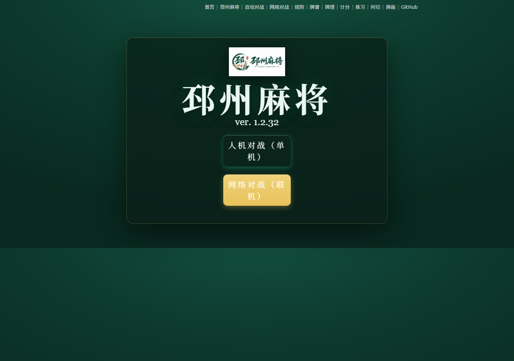

# 邳州麻将（查胡麻将）

基于 [kobalab/Majiang](https://github.com/kobalab/Majiang)（電脳麻将，MIT License）改造的邳州本地麻将，支持**单机人机对战**和**多人联网对战**。

<p align="center">
  
</p>

## 玩法特色

- **查胡麻将规则**：120 张牌 · 胡数/幺数计分 · 飘荤/塌牌/包庄
- **单机人机对战**：你 + 3 个 AI，纯前端即可运行
- **联网对战**：4 个真人局域网/公网对局（需要服务器端，见下文）
- **自动演示**：4 个 AI 自动对局，观战模式
- 进房即上牌桌，满 4 人自动开局，免登录自动随机名

<p align="center">
  
</p>

## 快速开始（单机）

需要 Node.js（>= 18）。

```bash
# 1. 安装依赖
npm install

# 2. 构建（HTML + CSS + JS）
npm run build

# 3. 起本地静态服务器
cd dist
python -m http.server 8123
```

浏览器打开 **http://127.0.0.1:8123**

| 页面 | 说明 |
|------|------|
| `index.html` | 主页：人机对战（单机）/ 网络对战（联机）入口 |
| `autoplay.html` | 自动演示（4 个 AI 自己打） |
| `rule.html` / `paipu.html` / `hule.html` / `drill.html` 等 | 规则、牌谱、计分、练习等工具页 |

## 联网对战（多人）

需要运行服务器端（`server/` 子目录），它会同时托管页面 + WebSocket 转发对局。

```bash
cd server
npm install
npm start -- --docroot ../dist --port 4615
```

> `server/` 的 `@kobalab/majiang-core` / `@kobalab/majiang-ai` 通过 `file:../src/...` 直接引用本仓库的邳州改版规则引擎，与前端规则一致。

启动后：

- **自己**：浏览器打开 `http://127.0.0.1:4615/netplay.html`（免登录，自动随机名进大厅）
- **局域网朋友**：打开 `http://<你的局域网IP>:4615/netplay.html`（`ipconfig` 可查 IP）
- 点「创建房间」→ 直接坐上牌桌等 → 朋友输房间号「加入房间」→ **满 4 人自动开局**

### 部署到公网（异地朋友）

- **云服务器**：腾讯云/阿里云轻量服务器装 Node.js，克隆本仓库后按上面步骤跑，朋友访问 `http://<服务器IP>:4615`
- **内网穿透**：用 cpolar / frp / ngrok 把你本机 4615 端口映射到公网，临时玩够用
- 生产环境建议 HTTPS（WebSocket 用 `wss`）

### 只有 1 个人想联网玩（AI 填位）

```bash
cd server
node bin/client.js -r <房间号> -n "AI-1"
node bin/client.js -r <房间号> -n "AI-2"
node bin/client.js -r <房间号> -n "AI-3"
```

## 技术栈

- 前端构建：`pug`（HTML 模板）+ `stylus`（CSS）+ `webpack`（JS 打包）
- 前端依赖：`jquery` + 三个本地子包 `majiang-core`（引擎）/ `majiang-ai`（AI）/ `majiang-ui`（界面）
- 服务器端：`express` + `socket.io`（WebSocket）+ `passport`（登录，本项目已默认免登录）

## 目录结构

```
├── src/
│   ├── js/               应用主程序（页面逻辑）
│   ├── html/             pug 模板（page/ 页面 + inc/ 片段）
│   ├── css/              stylus 样式
│   ├── majiang-core/     麻将引擎（手牌/牌山/向听/和了计算）
│   ├── majiang-ai/       AI 思考逻辑
│   └── majiang-ui/       界面渲染（牌面/棋盘/牌谱）
├── server/               联网对战服务器端（express + socket.io）
├── dist/                 构建产物
└── package.json
```

## 界面定制（本仓库已改）

- 玩家名旁的门风徽章只保留庄家「庄」字（去掉东/南/西/北金色字及阴影）
- 玩家信息条去掉了黑底、边框和阴影
- 主页去掉了「打几圈」下拉选择框（默认 2 圈 8 局）
- 联网界面全面中文化、免登录（随机名自动登录）
- 大厅/房间深色主题、进房即上牌桌、满 4 人自动开局
- 碰/杠/胡高优先级即时处理（不等吃家回复）+ 20 秒自动放弃防卡局
- 座位方向按邳州习惯：东(下) 南(左) 西(上) 北(右)

## 版权与许可

本项目基于 [kobalab/Majiang](https://github.com/kobalab/Majiang)（MIT License，作者 Satoshi Kobayashi）与 [kobalab/majiang-server](https://github.com/kobalab/majiang-server)（MIT License）改造，遵循 MIT 协议。

## 联系

- 微信号：**Air20222222**
